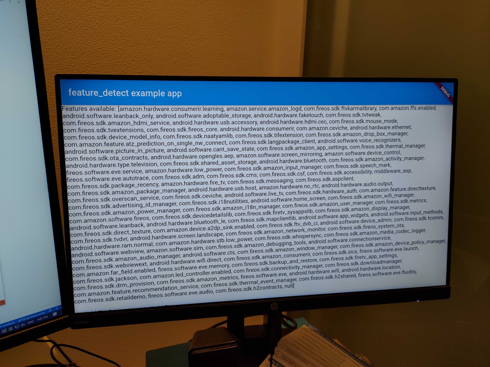

# feature_detect

A Flutter plugin for detecting platform features and UI mode at runtime on Android.

## Getting Started

Just import the package and use the static method `FeatureDetect.hasSystemFeature` to query platform features using their fully qualified name, as you would in the `uses-feature` xml property. 

You can list the names of all supported features with the `FeatureDetect.systemAvailableFeatures` property. 

The previous methods will return `null` if the plugin is detached from the activity.

Check the current UI mode with `FeatureDetect.currentUiModeType`. Appropriate UI mode constants are included in the class. Will return `UI_MODE_TYPE_UNDEFINED` if the plugin is detached from the activity.

See the [features reference](https://developer.android.com/guide/topics/manifest/uses-feature-element#features-reference) in the Android documentation for a list of features. This library also supports a few additional feature strings that aren't included in that documentation; you can check the complete list in [the AOSP source code](https://github.com/aosp-mirror/platform_frameworks_base/blob/master/core/java/android/content/pm/PackageManager.java#L1783).

Additionally, vendors may include nonstandard features on their devices.



## Example
```dart
import 'package:feature_detect/feature_detect.dart';

//...

final hasTouchscreen = await FeatureDetect.hasSystemFeature("android.hardware.touchscreen");
final isAndroidTv = (await FeatureDetect.currentUiModeType) == FeatureDetect.UI_MODE_TYPE_TELEVISION;

final allFeatures = await FeatureDetect.systemAvailableFeatures;
// Returns a list of feature names.

```

This plugin only works on Android and calls to these methods will throw an `UnsupportedError` on other platforms.